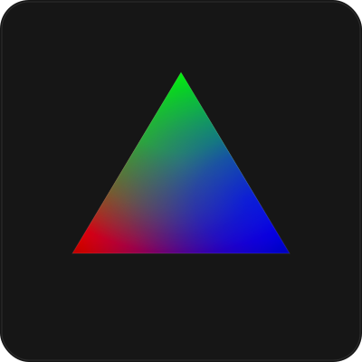

<picture>
  <source media="(prefers-color-scheme: dark)" srcset="./.github/assets/logo.svg">
    
</picture>

### `OpenGL-ASM x64 NASM Project (GLASM)`

[![License][license-badge]][LICENSE]
[](https://github.com/zschzen/GLASM/actions/workflows/macos.yml)

Simple OpenGL demo rendering a triangle using GLFW and NASM assembly.


<p align="center">
    
</p>

## Features
- Cross-platform support (macOS/Linux<sup>?</sup>/Windows<sup>?</sup>)
- GLFW window management
- Window resize handling
- Interactive keyboard controls
- Colored triangle rendering

> [!WARNING]
> Windows and Linux support are currently untested

## Requirements
- **Assembler**: [NASM](https://github.com/netwide-assembler/nasm.git) (v2.15+)
- **Linker**: [GCC](https://gcc.gnu.org/)
- **Dependencies**:
  - [GLFW](https://www.glfw.org/)
  - [OpenGL](https://www.opengl.org/)

## Build Instructions

```bash
make
```

Output will be in `build/GLASM` (or `GLASM.exe` on Windows)

## Run
```bash
./build/GLASM
```

## Clean Build
```bash
make clean
```

## Controls
- **ESC**: Exit application

## License
zlib/libpng License - See [LICENSE] file for details

---

[//]: (Externals)

[license-badge]: https://img.shields.io/github/license/zschzen/GLASM
[LICENSE]: https://github.com/zschzen/GLASM/blob/main/LICENSE

[//]: (EOF)
